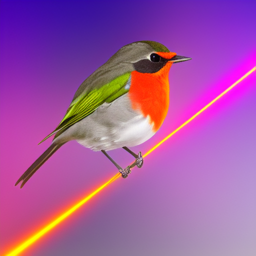

# RobinTrace


[](https://drone.git-or-miss.com/thomashoullier/robintrace)
[](https://codecov.io/gh/thomashoullier/robintrace)

RobinTrace is a sequential raytracing API for optical design.
It is implemented in C++.



## Development roadmap
We follow a roughly bottom-up development approach. The approximate current
roadmap is the following.

* ✅ RobinTrace (core): Done. API and features will continue to evolve.
* ✅ [rbt-samplings](https://github.com/thomashoullier/rbt-samplings): Done.
  New samplings and features will be added as the need arises.
* ⚙️  Render: 90% done. 3D rendering of optical parts and ray results.
* 💭 High-level optical systems class: In definition. This is the description
  of optical systems in a format familiar to optical designers. This includes
  interfaces to save and load optical system files.
* 💭 Ray-aiming: In definition. This allows defining optical systems with an
  aperture stop at an arbitrary optical part. Different kinds of solutions
  exist, we are still in the process of fleshing out how the API will look.
* 💭 Optical systems interface with optimization engines. Devise the tools for
  defining a callable interface with inputs and objectives.
* Milestone 1: RobinTrace is able to robustly optimize any kind of simple
  optical system.
* 💭 Freeform optical parts: adding freeform surfaces to the core engine. We
  delay this addition because of the potential complexity it introduces.
* 💭 Differential raytracing: Add "automatic" differentiation to raytracing,
  probably with [autodiff](https://autodiff.github.io/). This has applications
  in using optimization engines which make use of derivatives data. This also
  can help with ray-aiming.
* 💭 Performance overhaul and multithreading/GPU work. The idea is to take
  advantage of multi-core CPU and GPU. The parallelization will probably happen
  at the optimization engine interface. Opportunities to use GPU are not
  identified at this time.

## Documentation
Please refer to the [Doxygen documentation](https://thomashoullier.github.io/robintrace/index.html) (in progress).

In addition, the submodule poaky has its own LaTeX documentation.
It documents mainly the mathematical formulation of the operations and the
corresponding rationale. The API is documented in the doxygen documentation.
The report can be compiled from the LaTeX files in [latex-poaky](latex-poaky).
A compiled version is edited at [Poaky documentation
PDF](https://thomashoullier.com/writeups/robintrace-poaky/robintrace-poaky.html).

## Build
RobinTrace is configured with cmake. By default, only the library is built.
You can enable executable targets by setting the corresponding options.

Switch to a `/build` directory at the root of the project folder. Run:

```shell
cmake -Drobintrace_build_example=ON
      -Drobintrace_build_tests=ON
      -Drobintrace_build_coverage=ON
      -Drobintrace_build_benchmark=ON
      ..
```

This will download the dependencies and prepare the build targets.
The build targets are the following:

* `robintrace_example`: Example file for robintrace usage.
* `robintrace_test`: Test suite.
* `robintrace_benchmark`: Benchmark suite.
* `robintrace_coverage_report`: Code coverage report of the test suite. The
  report may be consulted at `build/robintrace_coverage_report/index.html`.

## Dependencies
We use the following libraries:
* `Eigen3`.

They are downloaded automatically (from online repositories)
through CMake when configuring.

In addition, only for tests:
* `Catch2`
* `Boost`

## Licensing
The software is licensed under MIT, the documentation under CC-BY.
